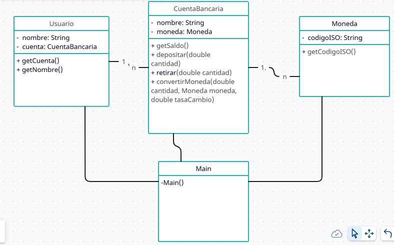
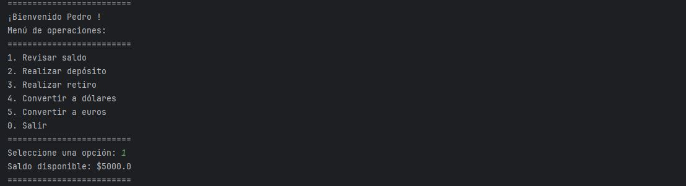
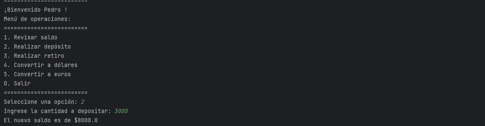
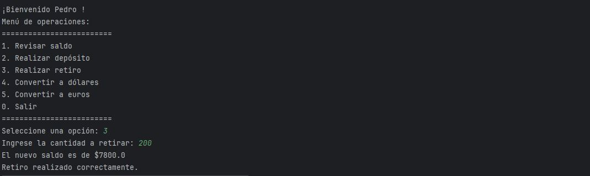
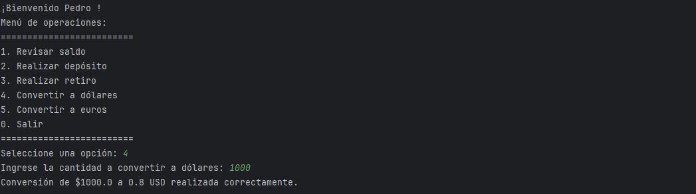

## Proyecto Alke Wallet

Proyecto que tiene como objetivo desarrollar una aplicación
de consola de una billetera digital que permita a los usuarios gestionar sus
activos financieros de manera segura y conveniente.

### Requerimientos:

- Administración de fondos: Los usuarios deben poder ver su saldo
disponible, realizar depósitos y retiros de fondos. 
- Conversión de moneda: Los usuarios deben poder convertir fondos
de una moneda a otra.

### Diagrama de clases:

### Funcionalidades:

#### Consulta de saldo

#### Realizar depósitos

#### Retiro de dinero

#### Conversión a dólares

#### Conversión a Euros 

